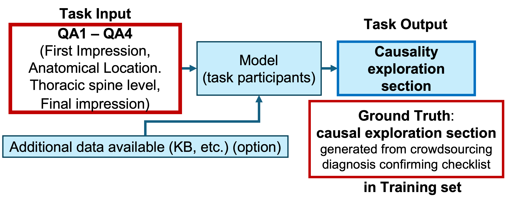
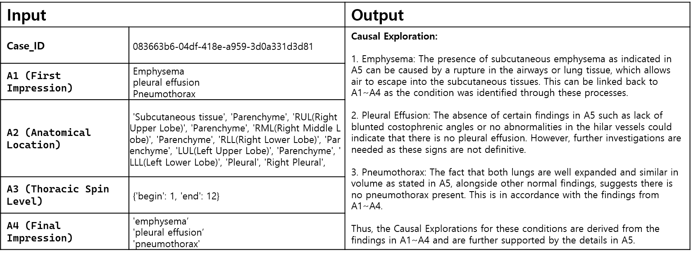

# Task 2: Causal Explanation Generation from Structured Questionnaire Responses in Crowdsourced Chest X-ray Interpretation 

## Introduction
Task 2 focuses on generating a diagnostic reasoning report that reflects the structured diagnostic flow used by radiologists. Using crowd-sourced data that simulates the radiologist’s diagnostic process, participants are tasked with creating a causality-focused report based on the causative relationships within the diagnostic reasoning flow. This approach aligns with the standardized diagnostic structure in radiology and provides insights into the reasoning process from initial observations to final conclusions.

## Goal
The goal of Task 2 is to simulate the diagnostic reasoning and causality flow that radiologists follow in real-world practice. This report will document each stage of diagnostic reasoning, from first impressions to final conclusions, using inputs that represent various steps of the radiologist's workflow. Participants are expected to construct a report that captures causality within the diagnostic reasoning process, creating a structured output that serves as a reference for complex case analysis.

## Data Format
The data for Task 2 is provided in CSV format, containing relevant information for each case in a structured tabular form. Each row in the CSV file represents a single case, with the following columns:

### Input part
#### A1 (First Impression): 
Initial observations by radiologists. This data serves as the starting point for diagnostic reasoning and may include preliminary hypotheses based on observed findings. 
Example: **Emphysema pleural effusion Pneumothorax**

#### A2 (Anatomical Location): 
Specific anatomical locations relevant to the case, helping narrow down the area of focus and refining the diagnostic flow. 
Example: **'Subcutaneous tissue', 'Parenchyme', 'RUL(Right Upper Lobe)', 'Parenchyme', 'RML(Right Middle Lobe)', 'Parenchyme', 'RLL(Right Lower Lobe)', 'Parenchyme', 'LUL(Left Upper Lobe)', 'Parenchyme', 'LLL(Left Lower Lobe)', 'Pleural', 'Right Pleural'**

#### A3 (Thoracic Spine Levels): 
Information on thoracic spine levels involved in the case, providing additional context for spine-related findings. 
Example: **{'begin': 1, 'end': 12}**

#### A4 (Final Impression): 
The concluding impressions by radiologists after evaluating all available information. This represents the final diagnostic insight derived from the data.  
Example: **''emphysema’,'pleural effusion’,'pneumothorax'**

### Ground-truth part
#### Causal section: 
A unique identifier for each case, used to locate the associated ground-truth causality report for validation. 
Example: **083663b6-04df-418e-a959-3d0a331d3d81**

Each of these components contributes to the overall diagnostic flow, replicating a radiologist’s structured thought process.

## Output
The output is a report that encapsulates the causality within the radiologists' diagnostic reasoning process, focusing on the causative relationships within the diagnostic flow. This report should interpret and connect the various data points (A1-A4) in a way that mirrors the diagnostic thought process, revealing the causal relationships embedded in the medical observations. The report must begin with the fixed heading "Causal Exploration:" followed by the causality analysis text that reflects the diagnostic flow and reasoning. This structured format is required for consistency.

## Process
**Utilize Diagnostic Flow Data**: Use the diagnostic flow data (A1-A4) to reconstruct the reasoning path of a radiologist, simulating the process they might follow when examining similar cases. 
**Generate Report Using Custom Model**: Develop your own method to integrate A1 through A4 into a coherent diagnostic report. 
**Format the Report**: Structure the causality analysis into a clear format. Create a section titled "Causal Exploration" where you will output the analyzed causality based on the diagnostic flow data. The report must begin with the fixed heading **"Causal Exploration:"** followed by the causality analysis text. This structure is mandatory to ensure consistency across submissions. This "Causal Exploration" section should include all identified causal links and inferred reasoning derived from the input data (A1-A4). Submit this "Causal Exploration" section, not the full report.  
**Validation and Case Matching**: Match each report with the ground-truth data associated with the 'Causal section' to validate the accuracy and completeness of your causality reasoning. 

## Example Output Structure

