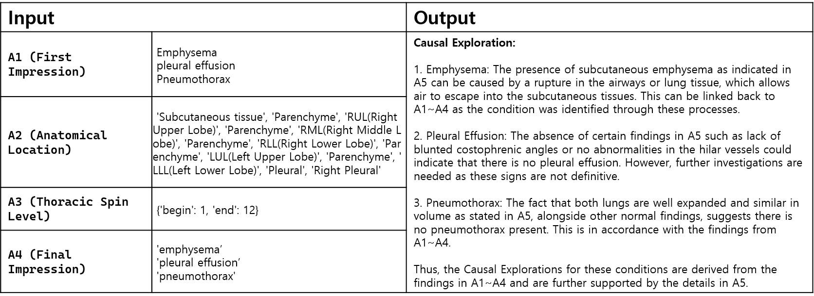

# Task 2 : Regenerating Diagnostic Processes and Reports

## Introduction
Task 2 focuses on generating a diagnostic reasoning report that reflects the structured diagnostic flow used by radiologists. Using crowd-sourced data that simulates the radiologist’s diagnostic process, participants are tasked with creating a causality-focused report based on the A5-ABCDE approach. This approach aligns with the standardized diagnostic structure in radiology and provides insights into the reasoning process from initial observations to final conclusions.

## Goal
The goal of Task 2 is to simulate the diagnostic reasoning and causality flow that radiologists follow in real-world practice. This report will document each stage of diagnostic reasoning, from first impressions to final conclusions, using inputs that represent various steps of the radiologist's workflow. Participants are expected to construct a report that captures causality within the diagnostic reasoning process, creating a structured output that serves as a reference for complex case analysis.

## Input
#### Case_ID: 
A unique identifier for each case, used to locate the associated ground-truth causality report for validation. 
Example: **a843748a-1575-4155-9c50-a44fdf7bea63**

#### A1 (First Impression): 
Initial observations by radiologists. This data serves as the starting point for diagnostic reasoning and may include preliminary hypotheses based on observed findings. 
Example: **pleural effusion atelectasis**

#### A2 (Anatomical Location): 
Specific anatomical locations relevant to the case, helping narrow down the area of focus and refining the diagnostic flow. 
Example: **'Parenchyme', 'RLL(Right Lower Lobe)','Mediastinum'**

#### A3 (Thoracic Spine Levels): 
Information on thoracic spine levels involved in the case, providing additional context for spine-related findings. 
Example: **{'begin': 6, 'end': 11}**

#### A4 (Final Impression): 
The concluding impressions by radiologists after evaluating all available information. This represents the final diagnostic insight derived from the data.  
Example: **'pleural effusion', 'atelectasis'**

Each of these components contributes to the overall diagnostic flow, replicating a radiologist’s structured thought process.

## Output
The output is a report that encapsulates the causality within the radiologists' diagnostic reasoning process, structured according to the A5-ABCDE approach. This report should interpret and connect the various data points (A1-A4) in a way that mirrors the diagnostic thought process, revealing the causal relationships embedded in the medical observations.

## Process
**Utilize Diagnostic Flow Data**: Use the diagnostic flow data (A1-A4) to reconstruct the reasoning path of a radiologist, simulating the process they might follow when examining similar cases. 
**Generate Report Using Custom Model**: Develop your own method to integrate A1 through A4 into a coherent diagnostic report. 
**Format the Report**: Structure the causality analysis into a clear format. Create a section titled "Causal Exploration" where you will output the analyzed causality based on the diagnostic flow data. This "Causal Exploration" section should include all identified causal links and inferred reasoning derived from the input data (A1-A4). Submit this "Causal Exploration" section, not the full report. 
**Validation and Case Matching**: Match each report with the ground-truth data associated with the Case_ID to validate the accuracy and completeness of your causality reasoning. 

## Example Output Structure

## Evaluation
To evaluate the effectiveness of the generated "Causal Exploration" output, the following metrics will be applied:

#### BLEU: 
Measures the precision of the generated causality text by comparing it to reference text, evaluating word overlap and sequence accuracy.

#### ROUGE : Focuses on recall by measuring how much of the reference causality information is captured in the generated output.

#### METEOR : 
Considers exact matches, synonyms, and stemming to provide a nuanced similarity measure between generated and reference text.

#### BERT Score: 
A semantic similarity metric that uses contextual embeddings to assess how well the generated text captures the meaning of the reference causality.

#### Cosine Similarity: 
Measures the similarity between the generated causality vector and the reference causality vector. This metric evaluates how closely the generated causality aligns with the reference in semantic space.

#### BioSentVec-based Evaluation: 
BioSentVec, a model trained on PubMed and MIMIC-III clinical notes, will be used to generate sentence embeddings for both the generated and reference causality texts. Cosine similarity will then be applied to these embeddings to measure coherence and semantic accuracy in the biomedical context.

These evaluation metrics provide a comprehensive assessment of the quality and accuracy of the "Causal Exploration" section, ensuring that it aligns with the reference data both in terms of content and semantic meaning.
